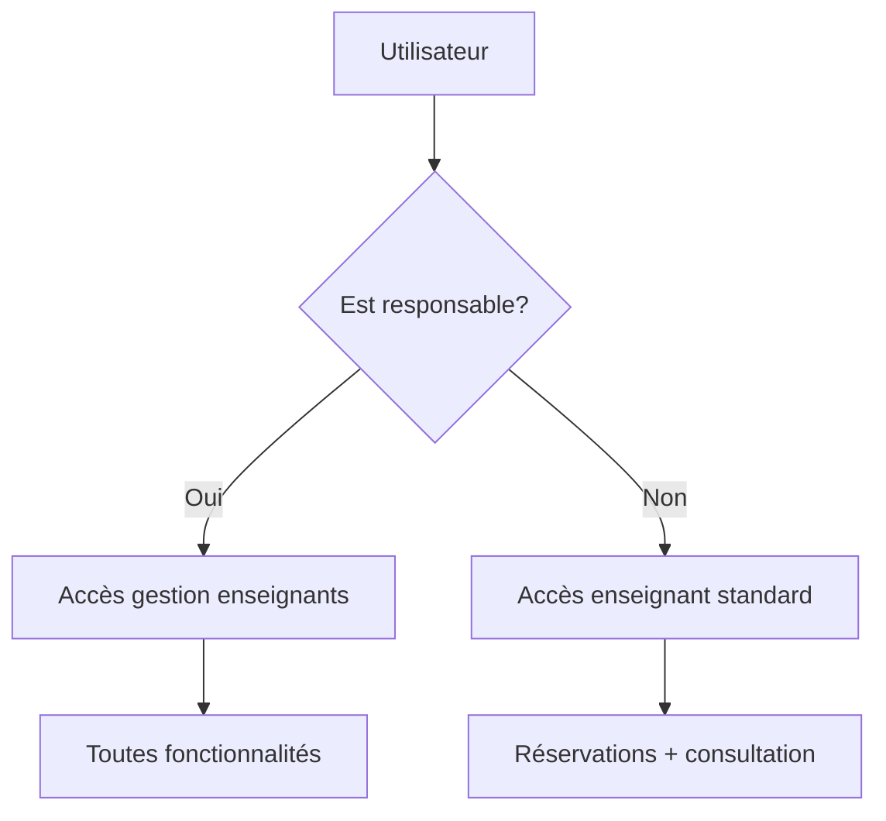

# 🎓 API de Gestion des Réservations - Établissement Scolaire


Une API REST complète développée avec Spring Boot pour gérer les réservations de salles de cours et de matériel pédagogique dans un établissement scolaire. Le système implémente un contrôle d'accès basé sur les rôles avec des responsables de formation qui gèrent les enseignants.

## 📖 Table des matières

- [🎯 Présentation du projet](#-présentation-du-projet)
- [🏗️ Architecture](#️-architecture)
- [🛠️ Technologies utilisées](#️-technologies-utilisées)
- [📋 Fonctionnalités](#-fonctionnalités)
- [🚀 Installation](#-installation)
- [⚙️ Configuration](#️-configuration)
- [📚 Documentation de l'API](#-documentation-de-lapi)
- [🔐 Gestion des rôles](#-gestion-des-rôles)
- [📊 Modèle de données](#-modèle-de-données)
- [🔒 Règles métier](#-règles-métier)
- [💡 Exemples d'utilisation](#-exemples-dutilisation)
- [🧪 Données de test](#-données-de-test)
- [🐛 Troubleshooting](#-troubleshooting)
- [📁 Structure du projet](#-structure-du-projet)
- [🤝 Contribution](#-contribution)

## 🎯 Présentation du projet

Ce projet répond au besoin de gestion des réservations dans un établissement scolaire avec les contraintes suivantes :

- **Réservations** : Seuls les enseignants peuvent réserver des salles et du matériel
- **Planning des salles** : Consultable par tous (enseignants et étudiants)
- **Récapitulatif enseignant** : Accessible uniquement aux enseignants
- **Gestion formation** : Chaque formation a un responsable qui peut éditer les récapitulatifs
- **Administration** : Les responsables de formation gèrent les enseignants

## 🏗️ Architecture

```
┌─────────────────┐    ┌─────────────────┐    ┌─────────────────┐
│   Controllers   │────│    Services     │────│  Repositories   │
│   (REST API)    │    │ (Logique métier)│    │   (Données)     │
└─────────────────┘    └─────────────────┘    └─────────────────┘
         │                       │                       │
         │                       │                       │
         ▼                       ▼                       ▼
┌─────────────────┐    ┌─────────────────┐    ┌─────────────────┐
│     DTOs &      │    │    Entities     │    │     MySQL       │
│   Validation    │    │ (JPA/Hibernate) │    │    Database     │
└─────────────────┘    └─────────────────┘    └─────────────────┘
```

### Couches de l'application
- **Contrôleurs** : Gestion des requêtes HTTP et réponses
- **Services** : Logique métier et règles de gestion
- **Repositories** : Accès aux données avec Spring Data JPA
- **Entités** : Modèle de données avec annotations JPA
- **Configuration** : Paramétrage et initialisation

## 🛠️ Technologies utilisées

| Technologie | Version | Rôle |
|-------------|---------|------|
| **Java** | 17+ | Langage de programmation |
| **Spring Boot** | 3.2.0 | Framework principal |
| **Spring Data JPA** | 3.2.0 | Couche d'abstraction pour la base de données |
| **Spring Web** | 3.2.0 | API REST |
| **Spring Validation** | 3.2.0 | Validation des données |
| **MySQL** | 8.0+ | Base de données relationnelle |
| **Hibernate** | 6.2+ | ORM (Object-Relational Mapping) |
| **Lombok** | 1.18+ | Réduction du code boilerplate |
| **Maven** | 3.6+ | Gestionnaire de dépendances |

## 📋 Fonctionnalités

### 🎓 Gestion académique
- ✅ **Enseignants** : CRUD complet avec spécialités
- ✅ **Formations** : Gestion avec responsables attribués
- ✅ **Contrôle d'accès** : Responsables gérant les enseignants

### 🏢 Gestion des ressources
- ✅ **Salles** : Capacité, type, équipements, disponibilité
- ✅ **Matériel** : Ordinateurs et vidéoprojecteurs avec états
- ✅ **Disponibilité** : Vérification en temps réel

### 📅 Système de réservations
- ✅ **Réservations** : Salle + matériel optionnel
- ✅ **Conflits** : Vérification automatique des créneaux
- ✅ **Validation** : Capacité, disponibilité, cohérence temporelle

### 📊 Plannings et rapports
- ✅ **Planning salle** : Consultable par tous
- ✅ **Planning enseignant** : Accès enseignants uniquement
- ✅ **Récapitulatif formation** : Éditable par responsables

## 🚀 Installation

### Prérequis système

```bash
# Vérifier Java 17+
java -version

# Vérifier Maven 3.6+
mvn -version

# Vérifier MySQL 8.0+
mysql --version
```

### 1. Cloner le projet

```bash
git clone https://github.com/votre-repo/reservation-api.git
cd reservation-api
```

### 2. Configuration de la base de données

```sql
-- Connexion à MySQL
mysql -u root -p

-- Création de la base de données
CREATE DATABASE etablissement_db;
CREATE USER 'reservation_user'@'localhost' IDENTIFIED BY 'motdepasse123';
GRANT ALL PRIVILEGES ON etablissement_db.* TO 'reservation_user'@'localhost';
FLUSH PRIVILEGES;
EXIT;
```

### 3. Configuration de l'application

Créer/modifier le fichier `src/main/resources/application.properties` :

```properties
# Configuration Base de données
spring.datasource.url=jdbc:mysql://localhost:3306/etablissement_db?createDatabaseIfNotExist=true&useSSL=false&serverTimezone=UTC
spring.datasource.username=reservation_user
spring.datasource.password=motdepasse123
spring.datasource.driver-class-name=com.mysql.cj.jdbc.Driver

# Configuration JPA/Hibernate
spring.jpa.hibernate.ddl-auto=create-drop
spring.jpa.show-sql=true
spring.jpa.properties.hibernate.format_sql=true
spring.jpa.properties.hibernate.dialect=org.hibernate.dialect.MySQL8Dialect

# Configuration serveur
server.port=8080
server.servlet.context-path=/api

# Configuration logging
logging.level.com.etablissement=DEBUG
logging.level.org.springframework.web=INFO
```

### 4. Installation des dépendances et compilation

```bash
# Installation des dépendances
mvn clean install

# Compilation sans tests (optionnel)
mvn clean compile
```

### 5. Lancement de l'application

```bash
# Lancement avec Maven
mvn spring-boot:run

# Ou compilation JAR et exécution
mvn clean package
java -jar target/reservation-api-0.0.1-SNAPSHOT.jar
```

### 6. Vérification de l'installation

```bash
# Test de connectivité
curl http://localhost:8080/api/enseignants

# Réponse attendue : Liste des enseignants (données de test)
```

## ⚙️ Configuration

### Profiles d'environnement

#### Développement (`application-dev.properties`)
```properties
spring.jpa.hibernate.ddl-auto=create-drop
spring.jpa.show-sql=true
logging.level.com.etablissement=DEBUG
```

#### Production (`application-prod.properties`)
```properties
spring.jpa.hibernate.ddl-auto=validate
spring.jpa.show-sql=false
logging.level.com.etablissement=INFO
```

#### Test (`application-test.properties`)
```properties
spring.datasource.url=jdbc:h2:mem:testdb
spring.datasource.driver-class-name=org.h2.Driver
spring.jpa.hibernate.ddl-auto=create-drop
```

### Variables d'environnement

```bash
export DB_HOST=localhost
export DB_PORT=3306
export DB_NAME=etablissement_db
export DB_USER=reservation_user
export DB_PASSWORD=motdepasse123
export SERVER_PORT=8080
```

## 📚 Documentation de l'API

### URL de base
```
http://localhost:8080/api
```

### 🔑 Responsables de Formation

#### Endpoints principaux
| Méthode | Endpoint | Description |
|---------|----------|-------------|
| `GET` | `/responsables/{id}/est-responsable` | Vérifier le statut de responsable |
| `GET` | `/responsables/{id}/profil` | Profil du responsable |
| `GET` | `/responsables/{id}/formations` | Formations gérées |
| `GET` | `/responsables/{id}/tableau-bord` | Dashboard du responsable |

#### Gestion des enseignants (Responsables uniquement)
| Méthode | Endpoint | Description |
|---------|----------|-------------|
| `POST` | `/responsables/{id}/enseignants` | Créer un enseignant |
| `GET` | `/responsables/{id}/enseignants` | Lister tous les enseignants |
| `GET` | `/responsables/{id}/enseignants/non-responsables` | Enseignants non-responsables |
| `PUT` | `/responsables/{id}/enseignants/{idEns}` | Modifier un enseignant |
| `DELETE` | `/responsables/{id}/enseignants/{idEns}` | Supprimer un enseignant |
| `POST` | `/responsables/{id}/formations/{idForm}/enseignants/{idEns}` | Assigner à formation |

### 👥 Enseignants

| Méthode | Endpoint | Description |
|---------|----------|-------------|
| `GET` | `/enseignants` | Lister tous les enseignants |
| `GET` | `/enseignants/{id}` | Détails d'un enseignant |
| `GET` | `/enseignants/email/{email}` | Recherche par email |
| `GET` | `/enseignants/recherche?nom={nom}` | Recherche par nom |
| `GET` | `/enseignants/specialite/{specialite}` | Filtrer par spécialité |
| `GET` | `/enseignants/responsables` | Lister les responsables |

### 🎓 Formations

| Méthode | Endpoint | Description |
|---------|----------|-------------|
| `GET` | `/formations` | Lister toutes les formations |
| `GET` | `/formations/{id}` | Détails d'une formation |
| `GET` | `/formations/code/{code}` | Recherche par code |
| `GET` | `/formations/niveau/{niveau}` | Filtrer par niveau |
| `GET` | `/formations/responsable/{idResp}` | Formations d'un responsable |
| `POST` | `/formations` | Créer une formation |
| `PUT` | `/formations/{id}` | Modifier une formation |
| `PATCH` | `/formations/{id}/responsable/{newId}` | Changer responsable |
| `DELETE` | `/formations/{id}` | Supprimer une formation |

### 🏢 Salles

| Méthode | Endpoint | Description |
|---------|----------|-------------|
| `GET` | `/salles` | Lister toutes les salles |
| `GET` | `/salles/{code}` | Détails d'une salle |
| `GET` | `/salles/disponibles` | Salles disponibles |
| `GET` | `/salles/type/{type}` | Filtrer par type |
| `GET` | `/salles/batiment/{batiment}` | Filtrer par bâtiment |
| `GET` | `/salles/capacite/{min}` | Capacité minimale |
| `GET` | `/salles/disponibles/periode?jour=&heureDebut=&heureFin=` | Disponibilité période |
| `POST` | `/salles` | Créer une salle |
| `PUT` | `/salles/{code}` | Modifier une salle |
| `PATCH` | `/salles/{code}/disponibilite?disponibilite=` | Changer disponibilité |
| `DELETE` | `/salles/{code}` | Supprimer une salle |

### 💻 Matériels

| Méthode | Endpoint | Description |
|---------|----------|-------------|
| `GET` | `/materiels` | Lister tout le matériel |
| `GET` | `/materiels/{code}` | Détails d'un matériel |
| `GET` | `/materiels/disponibles` | Matériel disponible |
| `GET` | `/materiels/ordinateurs` | Ordinateurs uniquement |
| `GET` | `/materiels/videoprojecteurs` | Vidéoprojecteurs uniquement |
| `GET` | `/materiels/marque/{marque}` | Filtrer par marque |
| `GET` | `/materiels/etat/{etat}` | Filtrer par état |
| `POST` | `/materiels` | Créer du matériel |
| `POST` | `/materiels/ordinateurs` | Créer un ordinateur |
| `POST` | `/materiels/videoprojecteurs` | Créer un vidéoprojecteur |
| `PUT` | `/materiels/{code}` | Modifier du matériel |
| `PATCH` | `/materiels/{code}/disponibilite?disponibilite=` | Changer disponibilité |
| `PATCH` | `/materiels/{code}/etat?etat=` | Changer état |
| `DELETE` | `/materiels/{code}` | Supprimer du matériel |

### 📅 Réservations

| Méthode | Endpoint | Description |
|---------|----------|-------------|
| `GET` | `/reservations` | Lister toutes les réservations |
| `GET` | `/reservations/{id}` | Détails d'une réservation |
| `GET` | `/reservations/enseignant/{id}` | Réservations d'un enseignant |
| `GET` | `/reservations/salle/{code}/planning?dateDebut=&dateFin=` | Planning d'une salle |
| `GET` | `/reservations/enseignant/{id}/planning?dateDebut=&dateFin=` | Planning enseignant |
| `GET` | `/reservations/date/{date}` | Réservations d'une date |
| `GET` | `/reservations/periode?dateDebut=&dateFin=` | Réservations période |
| `GET` | `/reservations/formation/{id}/recapitulatif?dateDebut=&dateFin=` | Récapitulatif formation |
| `POST` | `/reservations` | Créer une réservation |
| `PUT` | `/reservations/{id}` | Modifier une réservation |
| `PATCH` | `/reservations/{id}/annuler` | Annuler une réservation |
| `DELETE` | `/reservations/{id}` | Supprimer une réservation |

## 🔐 Gestion des rôles

### Types d'utilisateurs

#### 👑 Responsable de Formation
- **Identification** : Enseignant assigné comme responsable d'au moins une formation
- **Droits** :
    - Créer, modifier, supprimer des enseignants
    - Gérer les assignations aux formations
    - Accéder au tableau de bord de gestion
    - Effectuer des réservations
    - Consulter tous les plannings

#### 👨‍🏫 Enseignant Standard
- **Identification** : Enseignant non-responsable
- **Droits** :
    - Effectuer des réservations
    - Consulter son planning personnel
    - Consulter les plannings des salles

#### 👨‍🎓 Étudiant (Consultation uniquement)
- **Droits** :
    - Consulter les plannings des salles

### Workflow d'authentification (concept)



## 📊 Modèle de données

### Diagramme des entités

```
┌─────────────────┐       ┌─────────────────┐       ┌─────────────────┐
│   Enseignant    │──────▶│   Formation     │       │      Salle      │
│                 │1    1..n│                 │       │                 │
│ - idEnseignant  │       │ - idFormation   │       │ - codeSalle     │
│ - nom           │       │ - codeFormation │       │ - nomSalle      │
│ - prenom        │       │ - nomFormation  │       │ - capacite      │
│ - email         │       │ - responsable   │       │ - disponibilite │
│ - specialite    │       └─────────────────┘       │ - typeSalle     │
└─────────────────┘                                 └─────────────────┘
         │                                                    │
         │                   ┌─────────────────┐              │
         │                   │   Reservation   │              │
         └──────────────────▶│                 │◀─────────────┘
                        1..n │ - numero        │ 1..n
                             │ - jour          │
                             │ - heureDebut    │      ┌─────────────────┐
                             │ - heureFin      │      │    Materiel     │
                             │ - motif         │      │   (abstract)    │
                             └─────────────────┘      │                 │
                                      │               │ - codeMateriel  │
                                      │               │ - disponibilite │
                                      │               │ - marque        │
                                      └──────────────▶│ - etat          │
                                                 0..1 └─────────────────┘
                                                           ▲         ▲
                                                           │         │
                                                  ┌────────┴───┐ ┌───┴──────────┐
                                                  │ Ordinateur │ │VideoProjecteur│
                                                  │            │ │              │
                                                  │- processeur│ │- resolution  │
                                                  │- ram       │ │- luminosite  │
                                                  │- stockage  │ │- connectivite│
                                                  └────────────┘ └──────────────┘
```

### Relations principales

- **Enseignant ↔ Formation** : Un enseignant responsable par formation (1:N)
- **Enseignant ↔ Reservation** : Un enseignant par réservation (1:N)
- **Salle ↔ Reservation** : Une salle par réservation (1:N)
- **Materiel ↔ Reservation** : Matériel optionnel par réservation (0:N)
- **Formation ↔ Reservation** : Formation optionnelle par réservation (0:N)

## 🔒 Règles métier

### 🎯 Gestion des enseignants
- ✅ Seuls les **responsables de formation** peuvent créer, modifier ou supprimer des enseignants
- ✅ Un responsable ne peut **pas se supprimer** lui-même
- ✅ Un responsable ne peut **pas supprimer** un autre responsable de formation
- ✅ Chaque formation **doit avoir** un responsable (enseignant)
- ✅ L'email de l'enseignant doit être **unique**

### 📅 Contraintes de réservation
- ✅ **Pas de conflit horaire** pour une même salle
- ✅ **Pas de conflit horaire** pour un même matériel
- ✅ Vérification de la **capacité de la salle** vs nombre de participants
- ✅ Vérification de la **disponibilité** des ressources
- ✅ **Pas de réservation dans le passé**
- ✅ L'heure de fin doit être **après** l'heure de début

### 💻 États du matériel
- **Bon** : Disponible pour réservation
- **Moyen** : Disponible avec précautions
- **Défaillant** : Automatiquement **indisponible**

### 🔐 Droits d'accès
- **Réservations** : Accessibles aux enseignants uniquement
- **Planning des salles** : Consultable par tous (enseignants et étudiants)
- **Récapitulatif horaire par enseignant** : Accessible aux enseignants uniquement
- **Récapitulatif par formation** : Éditable par le responsable de la formation
- **Gestion des enseignants** : Réservée aux responsables de formation

## 💡 Exemples d'utilisation

### 1. Vérifier si un enseignant est responsable

```bash
curl -X GET "http://localhost:8080/api/responsables/1/est-responsable"

# Réponse
true
```

### 2. Créer un enseignant (par un responsable)

```bash
curl -X POST "http://localhost:8080/api/responsables/1/enseignants" \
  -H "Content-Type: application/json" \
  -d '{
    "nomEnseignant": "Durand",
    "prenomEnseignant": "Sophie",
    "email": "sophie.durand@etablissement.fr",
    "telephone": "0123456789",
    "specialite": "Informatique"
  }'

# Réponse
{
  "idEnseignant": 6,
  "nomEnseignant": "Durand",
  "prenomEnseignant": "Sophie",
  "email": "sophie.durand@etablissement.fr",
  "telephone": "0123456789",
  "specialite": "Informatique"
}
```

### 3. Rechercher des salles disponibles

```bash
curl -X GET "http://localhost:8080/api/salles/disponibles/periode?jour=2025-06-15&heureDebut=08:00&heureFin=10:00"

# Réponse
[
  {
    "codeSalle": "A101",
    "nomSalle": "Salle TP Informatique",
    "capacite": 24,
    "disponibilite": true,
    "typeSalle": "TP",
    "batiment": "Bâtiment A",
    "etage": "1er étage"
  }
]
```

### 4. Créer une réservation complète

```bash
curl -X POST "http://localhost:8080/api/reservations" \
  -H "Content-Type: application/json" \
  -d '{
    "jour": "2025-06-15",
    "heureDebut": "08:00",
    "heureFin": "10:00",
    "motif": "Cours de programmation Java",
    "nombreParticipants": 24,
    "enseignant": {"idEnseignant": 1},
    "salle": {"codeSalle": "A101"},
    "materiel": {"codeMateriel": "PC001"},
    "formation": {"idFormation": 1}
  }'

# Réponse
{
  "numero": 5,
  "jour": "2025-06-15",
  "heureDebut": "08:00",
  "heureFin": "10:00",
  "motif": "Cours de programmation Java",
  "statut": "CONFIRMEE",
  "nombreParticipants": 24,
  "enseignant": {
    "idEnseignant": 1,
    "nomEnseignant": "Dupont",
    "prenomEnseignant": "Jean"
  },
  "salle": {
    "codeSalle": "A101",
    "nomSalle": "Salle TP Informatique"
  }
}
```

### 5. Obtenir le planning d'une salle

```bash
curl -X GET "http://localhost:8080/api/reservations/salle/A101/planning?dateDebut=2025-06-10&dateFin=2025-06-20"

# Réponse
[
  {
    "numero": 1,
    "jour": "2025-06-10",
    "heureDebut": "08:00",
    "heureFin": "10:00",
    "motif": "Cours de programmation Java",
    "enseignant": {
      "nomEnseignant": "Dupont",
      "prenomEnseignant": "Jean"
    }
  }
]
```

### 6. Tableau de bord d'un responsable

```bash
curl -X GET "http://localhost:8080/api/responsables/1/tableau-bord"

# Réponse
{
  "nombreFormations": 1,
  "nombreEnseignantsTotal": 5,
  "nombreEnseignantsNonResponsables": 2,
  "formations": [
    {
      "idFormation": 1,
      "codeFormation": "INFO-L3",
      "nomFormation": "Licence 3 Informatique"
    }
  ],
  "enseignants": [...]
}
```

### 7. Créer un ordinateur

```bash
curl -X POST "http://localhost:8080/api/materiels/ordinateurs" \
  -H "Content-Type: application/json" \
  -d '{
    "codeMateriel": "PC004",
    "marque": "Dell",
    "modele": "Latitude 5530",
    "etat": "Bon",
    "dateAcquisition": "2025-01-15",
    "localisation": "Magasin informatique",
    "processeur": "Intel i7-1265U",
    "ram": "16GB",
    "stockage": "512GB SSD",
    "tailleEcran": "15.6\"",
    "systemeExploitation": "Windows 11",
    "typeOrdinateur": "Portable"
  }'
```

### 8. Gérer les erreurs

```bash
# Tentative de réservation avec conflit
curl -X POST "http://localhost:8080/api/reservations" \
  -H "Content-Type: application/json" \
  -d '{
    "jour": "2025-06-10",
    "heureDebut": "08:00",
    "heureFin": "10:00",
    "enseignant": {"idEnseignant": 2},
    "salle": {"codeSalle": "A101"}
  }'

# Réponse d'erreur
{
  "timestamp": "2025-06-10T10:30:00",
  "status": 400,
  "error": "Bad Request",
  "message": "Conflit de réservation pour la salle",
  "path": "/api/reservations"
}
```

## 🧪 Données de test

L'application charge automatiquement des données de test au premier démarrage :

### 👥 Enseignants (5 total)

#### Responsables de formation
| ID | Nom | Prénom | Email | Spécialité | Rôle |
|----|-----|--------|--------|------------|------|
| 1 | Dupont | Jean | jean.dupont@etablissement.fr | Informatique | Responsable INFO-L3 |
| 2 | Martin | Marie | marie.martin@etablissement.fr | Mathématiques | Responsable MATH-M1 |
| 3 | Bernard | Pierre | pierre.bernard@etablissement.fr | Physique | Responsable PHYS-L2 |

#### Enseignants standard
| ID | Nom | Prénom | Email | Spécialité |
|----|-----|--------|--------|------------|
| 4 | Leroy | Sophie | sophie.leroy@etablissement.fr | Informatique |
| 5 | Moreau | Paul | paul.moreau@etablissement.fr | Mathématiques |

### 🎓 Formations (3 total)
| ID | Code | Nom | Niveau | Responsable | Durée |
|----|------|-----|--------|-------------|-------|
| 1 | INFO-L3 | Licence 3 Informatique | L3 | Jean Dupont | 600h |
| 2 | MATH-M1 | Master 1 Mathématiques | M1 | Marie Martin | 480h |
| 3 | PHYS-L2 | Licence 2 Physique | L2 | Pierre Bernard | 520h |

### 🏢 Salles (4 total)
| Code | Nom | Capacité | Type | Bâtiment | Équipements |
|------|-----|----------|------|----------|-------------|
| A101 | Salle TP Informatique | 24 | TP | Bâtiment A | 24 postes, tableau interactif |
| B205 | Amphithéâtre | 120 | Amphi | Bâtiment B | Audio, vidéoprojecteur fixe |
| C103 | Salle de cours | 30 | Cours | Bâtiment C | Tableau blanc, prises |
| A204 | Laboratoire Physique | 16 | Laboratoire | Bâtiment A | Équipements labo, hottes |

### 💻 Matériels (6 total)

#### Ordinateurs
| Code | Marque | Modèle | État | Processeur | RAM | Stockage |
|------|--------|--------|------|------------|-----|----------|
| PC001 | Dell | Latitude 5520 | Bon | Intel i5-11400H | 16GB | 512GB SSD |
| PC002 | HP | EliteBook 840 | Bon | Intel i7-1165G7 | 16GB | 1TB SSD |
| PC003 | Lenovo | ThinkPad T14 | Moyen | AMD Ryzen 5 | 8GB | 256GB SSD |

#### Vidéoprojecteurs
| Code | Marque | Modèle | État | Résolution | Luminosité |
|------|--------|--------|------|------------|------------|
| VP001 | Epson | EB-X41 | Bon | 1024x768 | 3600 lumens |
| VP002 | BenQ | MX550 | Bon | 1024x768 | 3600 lumens |
| VP003 | Canon | LV-X320 | Défaillant | 1024x768 | 3200 lumens |

### 📅 Réservations (4 exemples)
- **Aujourd'hui 8h-10h** : Jean Dupont, Salle A101, PC001 (Cours Java)
- **Demain 14h-16h** : Marie Martin, Salle B205, VP001 (Conférence math)
- **Après-demain 10h-12h** : Pierre Bernard, Salle A204 (TP Physique)
- **Demain 16h30-18h30** : Jean Dupont, Salle C103, VP002 (Algo)

## 🐛 Troubleshooting

### Problèmes courants

#### ❌ Erreur de connexion à la base de données
```
Error: Unable to connect to MySQL server
```
**Solutions :**
1. Vérifier que MySQL est démarré : `sudo service mysql start`
2. Vérifier les credentials dans `application.properties`
3. Créer la base de données : `CREATE DATABASE etablissement_db;`

#### ❌ Port 8080 déjà utilisé
```
Error: Port 8080 was already in use
```
**Solutions :**
1. Changer le port dans `application.properties` : `server.port=8081`
2. Tuer le processus : `lsof -ti:8080 | xargs kill -9`

#### ❌ Erreur de validation
```
400 Bad Request: Validation failed
```
**Solutions :**
1. Vérifier le format JSON des requêtes
2. S'assurer que tous les champs obligatoires sont présents
3. Respecter les contraintes (email unique, dates cohérentes, etc.)

#### ❌ Conflit de réservation
```
400 Bad Request: Conflit de réservation pour la salle
```
**Solutions :**
1. Vérifier la disponibilité avec `/salles/disponibles/periode`
2. Choisir un autre créneau horaire
3. Utiliser une autre salle

### Logs et debugging

#### Activer les logs SQL
```properties
spring.jpa.show-sql=true
spring.jpa.properties.hibernate.format_sql=true
logging.level.org.hibernate.SQL=DEBUG
logging.level.org.hibernate.type.descriptor.sql.BasicBinder=TRACE
```

#### Logs applicatifs
```properties
logging.level.com.etablissement=DEBUG
logging.level.org.springframework.web=DEBUG
```

### Tests de connectivité

```bash
# Test API
curl -i http://localhost:8080/api/enseignants

# Test base de données
mysql -u reservation_user -p etablissement_db -e "SHOW TABLES;"

# Test performances
curl -w "@curl-format.txt" -o /dev/null -s http://localhost:8080/api/reservations
```

## 📁 Structure du projet

```
reservation-api/
├── src/
│   ├── main/
│   │   ├── java/com/example/CSI/
│   │   │   ├── GestMatApplication.java          # Classe principale
│   │   │   ├── config/
│   │   │   │   ├── DataLoader.java           # API Enseignants
│   │   │   │   ├── SwaggerConfig.java
│   │   │   ├── controller/
│   │   │   │   ├── EnseignantController.java           # API Enseignants
│   │   │   │   ├── FormationController.java            # API Formations
│   │   │   │   ├── SalleController.java                # API Salles
│   │   │   │   ├── MaterielController.java             # API Matériels
│   │   │   │   ├── ReservationController.java          # API Réservations
│   │   │   │   └── ResponsableController.java          # API Responsables
│   │   │   ├── model/
│   │   │   │   ├── Enseignant.java                     # Entité Enseignant
│   │   │   │   ├── Formation.java                      # Entité Formation
│   │   │   │   ├── Salle.java                          # Entité Salle
│   │   │   │   ├── Materiel.java                       # Entité abstraite Matériel
│   │   │   │   ├── Ordinateur.java                     # Entité Ordinateur
│   │   │   │   ├── VideoProjecteur.java                # Entité VideoProjecteur
│   │   │   │   └── Reservation.java                    # Entité Réservation
│   │   │   ├── repository/
│   │   │   │   ├── EnseignantRepository.java           # Repository Enseignant
│   │   │   │   ├── FormationRepository.java            # Repository Formation
│   │   │   │   ├── SalleRepository.java                # Repository Salle
│   │   │   │   ├── MaterielRepository.java             # Repository Matériel
│   │   │   │   └── ReservationRepository.java          # Repository Réservation
│   │   │   ├── service/
│   │   │   │   ├── EnseignantService.java              # Service Enseignant
│   │   │   │   ├── FormationService.java               # Service Formation
│   │   │   │   ├── SalleService.java                   # Service Salle
│   │   │   │   ├── MaterielService.java                # Service Matériel
│   │   │   │   ├── ReservationService.java             # Service Réservation
│   │   │   │   └── ResponsableService.java             # Service Responsable
│   │   │   └── exception/
│   │   │       └── GlobalExceptionHandler.java         # Gestion globale erreurs
│   │   └── resources/
│   │       ├── application.properties                   # Configuration principale
│   │       
│   └── test/
│       └── java/com/example/CSI/
│           └── GestMatApplicationTests.java      # Tests unitaires
├── target/                                              # Dossier de compilation Maven
├── pom.xml                                              # Configuration Maven
├── README.md                                            # Cette documentation
└── .gitignore                                           # Fichiers ignorés par Git
```

### Description des packages

- **`config`** : Configuration et initialisation (données de test)
- **`controller`** : Contrôleurs REST (endpoints API)
- **`model`** : Entités JPA (modèle de données)
- **`repository`** : Repositories Spring Data JPA (accès données)
- **`service`** : Services métier (logique applicative)
- **`exception`** : Gestion des exceptions et erreurs

## 🤝 Contribution

### Workflow de développement

1. **Fork** le projet
2. **Créer** une branche feature (`git checkout -b feature/nouvelle-fonctionnalite`)
3. **Commiter** les changements (`git commit -am 'Ajouter nouvelle fonctionnalité'`)
4. **Pousser** la branche (`git push origin feature/nouvelle-fonctionnalite`)
5. **Créer** une Pull Request

### Standards de code

#### Conventions Java
- **Nommage** : CamelCase pour les classes, camelCase pour les méthodes
- **Packages** : Minuscules, séparés par des points
- **Constantes** : UPPER_SNAKE_CASE

#### Annotations Lombok
```java
@Data                    // Getters/Setters automatiques
@NoArgsConstructor      // Constructeur sans arguments
@AllArgsConstructor     // Constructeur avec tous arguments
@RequiredArgsConstructor // Constructeur champs final/non-null
@Slf4j                  // Logger automatique
```

#### Structure des endpoints
```java
@RestController
@RequestMapping("/api/resource")
@RequiredArgsConstructor
@Slf4j
@CrossOrigin(origins = "*")
public class ResourceController {
    // Implémentation
}
```

### Tests

#### Tests unitaires
```bash
# Exécuter tous les tests
mvn test

# Tests spécifiques
mvn test -Dtest=EnseignantServiceTest

# Tests avec couverture
mvn test jacoco:report
```

#### Tests d'intégration
```bash
# Tests avec profil test
mvn test -Dspring.profiles.active=test
```

---

## 📄 Licence

Ce projet est sous licence MIT. Voir le fichier `LICENSE` pour plus de détails.

## 📞 Support

- **Documentation** : Ce README
- **Issues** : GitHub Issues
- **Email** : piodjiele@gmail.com

---

**Développé avec ❤️ pour la gestion efficace des réservations dans les établissements scolaires.**

